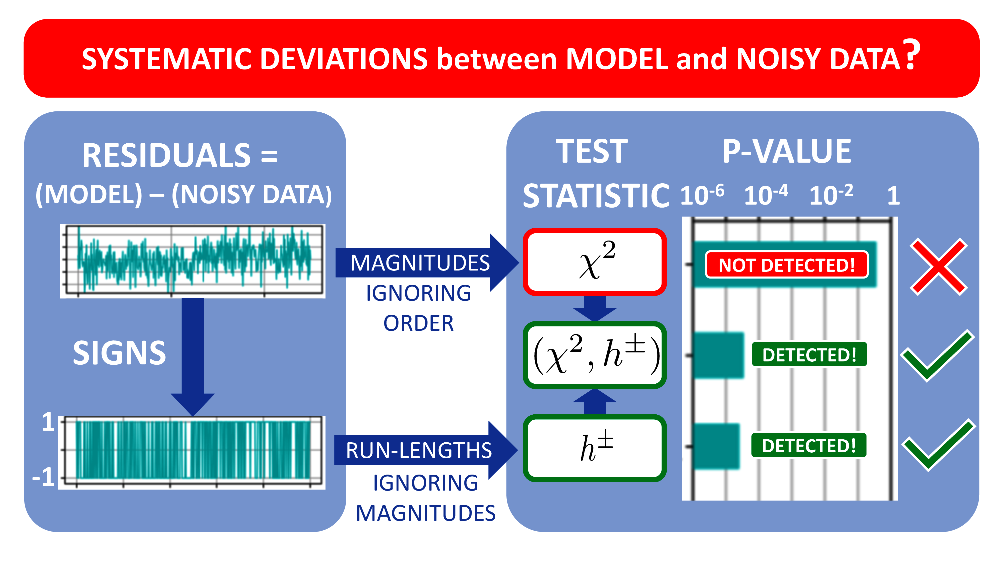

# hplusminus



Copyright (C) 2020 Juergen Koefinger, Max Planck Institute of Biophysics, Frankfurt am Main, Germany

With contributions from Klaus Reuter, Max Planck Computing and Data Facility, Garching, Germany.

Released under the MIT Licence, see the file LICENSE.txt.

## Reference

**Powerful statistical tests for ordered data** \
Juergen Koefinger and Gerhard Hummer \
Preprint: https://doi.org/10.26434/chemrxiv.13373351 (2020)

## Requirements

* Python 3
* Jupyter (for Jupyter notebooks only)
* Python modules (can be installed with `pip` or `conda`):
  * numpy
  * scipy
  * mpmath
  * matplotlib (for Jupyter notebooks only)

## Installation

The **hplusminus** package can be installed in the following ways:

### `pip` installation

To install via `pip` please run:

```bash
pip install --user hplusminus
```

### Installation from source

After downloading and unpacking the source tarball please run:

```bash
python setup.py install --user
```

## Python script

### *hplusminus_tests.py*

Python 3 script to evaluate test statistics for normalized residuals.
This script contains the central functionality.

See help for more information and usage:

```bash
python hplusminus_tests.py -h
````

#### Example for alternative model

```bash
python hplusminus_tests.py ./examples/alternative_model_normalized_residuals.txt
```

#### Example for true model

```bash
python hplusminus_tests.py ./examples/true_model_normalized_residuals.txt
```

## Jupyter notebooks

Notebooks in the directory *./ipynb/* serve to explore the capabilties of our statistical tests.
See notebooks themselves for more details on purpose and usage.

### *hplusminus_tests.ipynb*

Evaluate statistical tests.

Addtionally to the functionality of *hplusminus_tests.py*, the notebook provides
plots of normalized residuals and signs and a bar-plot to visually compare the p-values of the various tests.

### *hplusminus_statistical_power.ipynb*

Calculate statistical power for all tests and given model

### *generate_models_for_residuals.ipynb*

Generate models for residuals, which can be used with the Python script *hplusminus_tests.py* and the Jupyter notebooks *hplusminus_tests.ipyn* and *hplusminus_statistical_power.ipynb*.

## Python package *hplusminus*

### *tests.py*

Python 3 module file containing functions for the convenient evaluation of the statistical tests.

### *io.py*

Python 3 module file for input and output.

### *rld.py*

Python 3 module file for the calculation of the Shannon information (neg. log-probabilities) of all test statistics (rld for Run-Length Distribution).
Required by Python script *hplusminus_tests.py* and Jupyter notebooks *hplusminus_tests.ipynb* and *hplusminus_statistical_power.ipynb*.

### *sid.py*

Python 3 module file for the calculation of p-values using the gamma distribution approximation
of the cumulative Shannon information distributions (SID).
Required by Python script *hplusminus_tests.py* and Jupyter notebooks *hplusminus_tests.ipynb* and *hplusminus_statistical_power.ipynb*.


### Directories

#### *./hplusminus/*

Python module hplusminus

#### *./examples/*

Examples for normalized residuals generated with *generate_models_for_residuals.ipynb*.

#### *./hplusminus/gsp/*

Numpy binary files containing B-spline parameters (knots and coefficients) for gamma distribution parameters for all tests.
Information is read from these files. No need for user interaction.

#### *./ipynb*

Directory containing Jupyter notebooks.

##### *./ipynb/data/*

Directory used by Jupyter notebooks for input/output.
